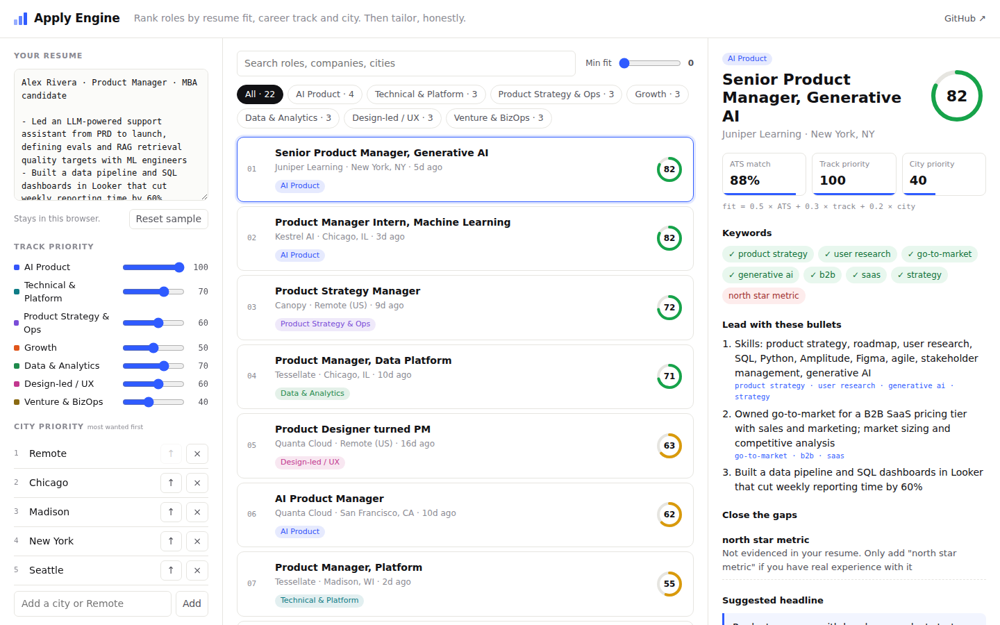

# Apply Engine

**Job discovery, ATS matching and resume tailoring for people who treat a job search like a product.** Every role gets a fit score from three signals: how well your resume covers the posting, how much you want that career track, and how much you want that city. For the role you pick, it shows exactly which bullets to lead with and which gaps to close, and it won't tell you to claim skills you don't have.

**[Open the app →](https://murtuzabuilds.github.io/apply-engine/)**



## The problem

A job search has the problem I used to solve for clients: too much manual work between the data and the decision. Fifty postings, one resume, and no consistent way to decide which ten deserve a tailored application.

## How the score works

```
fit = 0.5 × ATS match + 0.3 × track priority + 0.2 × city priority
```

| Signal | How it's computed |
|---|---|
| **ATS match** | Keywords are pulled from the posting using a product-role lexicon (multi-word skills like *go-to-market*, *a/b testing*, *RAG* are matched as phrases, synonyms like *LLM/LLMs* count once) plus terms the posting repeats. Match = share of those keywords your resume evidences |
| **Track priority** | Each posting is classified into one of **seven career tracks** by reading the title and description. You set how much you want each track (0–100) |
| **City priority** | You rank cities, most wanted first. "Remote" is a city. Score falls off linearly down your list; unlisted cities score 0 |

### The seven tracks

AI Product · Technical & Platform · Product Strategy & Ops · Growth · Data & Analytics · Design-led / UX · Venture & BizOps

## Tailoring, honestly

For the selected role:

- **Lead with these bullets:** your resume bullets ranked by how many of the posting's keywords they already evidence, with a small boost for bullets that carry a number.
- **Close the gaps:** for each missing keyword, it either points to the bullet where the skill would honestly fit ("If it's true, name *SQL* in: …") or says plainly that it isn't evidenced and should only be added if you have the experience.
- **Suggested headline:** one line built from the skills you actually match.
- **Copy tailoring notes:** all of the above on the clipboard, ready for your resume doc.

## Private by design

Your resume, track weights and cities live in `localStorage`. There is no backend and no tracking.

## Run it

```bash
git clone https://github.com/murtuzabuilds/apply-engine && cd apply-engine
npm install
npm run dev      # http://localhost:5173
npm test         # 8 tests on the scoring and tailoring logic
```

Every push to `main` runs the tests, builds with Vite and deploys to GitHub Pages (`.github/workflows/pages.yml`).

## Layout

```
src/lib/text.js      keyword extraction and the skills lexicon
src/lib/tracks.js    the seven tracks and the classifier
src/lib/score.js     ATS match, city priority, overall fit and ranking
src/lib/tailor.js    bullet ranking, gap suggestions, headline
src/App.jsx          the three-panel React UI
src/data/            sample postings (fictional companies) and a sample resume
tests/               node's built-in test runner, no extra dependencies
```

## Roadmap

- [ ] Import postings from a URL or a saved search
- [ ] Application pipeline board (saved → applied → interview → offer) with follow-up reminders
- [ ] Per-track resume variants, so tailoring starts from the right base

---

Built by [Murtuza](https://murtuzabuilds.com). MIT licensed. Sample postings and the sample resume are fictional.
